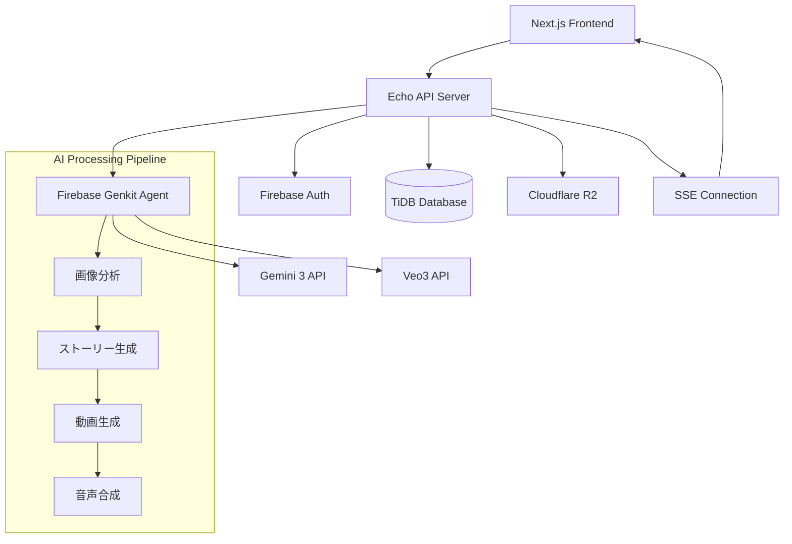
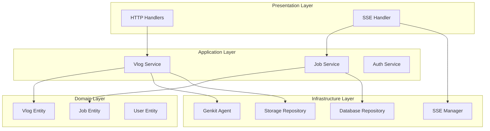

# 設計書

## 概要

AI旅行Vlog自動生成機能は、Firebase Genkit for GoとVertex AI (Gemini 3)、Veo3を活用して、ユーザーがアップロードした旅行の写真・動画から自動的に魅力的なVlogを生成するシステムです。非同期処理とSSEによるリアルタイム通信を通じて、ユーザーに優れた体験を提供します。

## アーキテクチャ

### システム全体アーキテクチャ



### レイヤーアーキテクチャ



## コンポーネントと インターフェース

### 1. HTTPハンドラー層

#### VlogHandler

```go
type VlogHandler struct {
    vlogService       domain.VlogService
    sessionService    domain.AnonymousSessionService
    sseManager        *sse.Manager
}

// POST /api/agent/create-vlog
func (h *VlogHandler) CreateVlog(c echo.Context) error

// GET /api/agent/vlog/{id}
func (h *VlogHandler) GetVlog(c echo.Context) error

// GET /api/agent/vlog/{id}/status
func (h *VlogHandler) GetVlogStatus(c echo.Context) error

// GET /api/agent/vlog/stream/{jobId}
func (h *VlogHandler) StreamProgress(c echo.Context) error
```

#### SSEHandler

```go
type SSEHandler struct {
    sseManager *sse.Manager
}

// GET /api/sse/connect/{jobId}
func (h *SSEHandler) Connect(c echo.Context) error
```

### 2. アプリケーションサービス層

#### VlogService

```go
type VlogService interface {
    CreateVlog(ctx context.Context, req CreateVlogRequest) (*CreateVlogResponse, error)
    GetVlog(ctx context.Context, vlogID string, userID string) (*Vlog, error)
    GetVlogStatus(ctx context.Context, jobID string) (*JobStatus, error)
}

type VlogServiceImpl struct {
    genkitAgent   GenkitAgent
    jobRepo       VlogJobRepository
    vlogRepo      VlogRepository
    storageRepo   StorageRepository
    sessionRepo   AnonymousSessionRepository
    sseManager    *sse.Manager
}
```

#### VlogJobService

```go
type VlogJobService interface {
    CreateJob(ctx context.Context, userID *string, sessionToken *string, jobType string) (*VlogJob, error)
    UpdateJobStatus(ctx context.Context, jobID string, status JobStatus) error
    GetJob(ctx context.Context, jobID string) (*VlogJob, error)
}
```

#### AnonymousSessionService

```go
type AnonymousSessionService interface {
    CreateSession(ctx context.Context) (*AnonymousSession, error)
    ValidateSession(ctx context.Context, sessionToken string) (*AnonymousSession, error)
    IncrementUsage(ctx context.Context, sessionToken string) error
}
```

### 3. ドメイン層

#### Genkit Agent Interface

```go
type GenkitAgent interface {
    GenerateVlog(ctx context.Context, req VlogGenerationRequest) (*VlogGenerationResponse, error)
    AnalyzeImages(ctx context.Context, images []ImageData) (*ImageAnalysisResult, error)
    GenerateStory(ctx context.Context, analysis ImageAnalysisResult) (*StoryResult, error)
    GenerateVideo(ctx context.Context, story StoryResult, images []ImageData) (*VideoResult, error)
}
```

#### Repository Interfaces

```go
type VlogRepository interface {
    Create(ctx context.Context, vlog *Vlog) error
    GetByID(ctx context.Context, id string) (*Vlog, error)
    GetByUserID(ctx context.Context, userID string) ([]*Vlog, error)
    Update(ctx context.Context, vlog *Vlog) error
    Delete(ctx context.Context, id string) error
}

type VlogJobRepository interface {
    Create(ctx context.Context, job *VlogJob) error
    GetByID(ctx context.Context, id string) (*VlogJob, error)
    UpdateStatus(ctx context.Context, id string, status JobStatus) error
    GetActiveJobs(ctx context.Context) ([]*VlogJob, error)
}

type AnonymousSessionRepository interface {
    Create(ctx context.Context, session *AnonymousSession) error
    GetByToken(ctx context.Context, token string) (*AnonymousSession, error)
    Update(ctx context.Context, session *AnonymousSession) error
    DeleteExpired(ctx context.Context) error
}

type StorageRepository interface {
    UploadFile(ctx context.Context, key string, data []byte, contentType string) (*UploadResult, error)
    GetFileURL(ctx context.Context, key string) (string, error)
    DeleteFile(ctx context.Context, key string) error
}
```

### 4. インフラストラクチャ層

#### SSE Manager

```go
type Manager struct {
    connections map[string]*Connection
    mutex       sync.RWMutex
}

type Connection struct {
    JobID    string
    UserID   string
    Channel  chan Event
    Context  context.Context
    Cancel   context.CancelFunc
}

type Event struct {
    Type string      `json:"type"`
    Data interface{} `json:"data"`
}
```

## データモデル

### データベーススキーマ

既存のvlogsテーブルを拡張し、新しいテーブルを追加します。

#### vlog_jobs テーブル（新規追加）

```sql
CREATE TABLE IF NOT EXISTS vlog_jobs (
    id VARCHAR(255) PRIMARY KEY,
    version INT NOT NULL DEFAULT 0 COMMENT 'Optimistic locking version',
    create_user_id VARCHAR(255) NULL COMMENT 'Created by user ID',
    update_user_id VARCHAR(255) NULL COMMENT 'Updated by user ID',
    user_id VARCHAR(255) NULL COMMENT 'User ID (null for anonymous)',
    session_token VARCHAR(255) NULL COMMENT 'Anonymous session token',
    job_type VARCHAR(50) NOT NULL DEFAULT 'vlog_generation' COMMENT 'Job type',
    status VARCHAR(50) NOT NULL DEFAULT 'queued' COMMENT 'queued, processing, completed, failed, cancelled',
    progress_percentage INT DEFAULT 0 COMMENT 'Progress percentage (0-100)',
    current_step VARCHAR(100) NULL COMMENT 'Current processing step',
    estimated_completion_time TIMESTAMP NULL COMMENT 'Estimated completion time',
    error_message TEXT NULL COMMENT 'Error message if failed',
    input_data JSON NULL COMMENT 'Input parameters',
    result_data JSON NULL COMMENT 'Generation results',
    created_at TIMESTAMP NOT NULL DEFAULT CURRENT_TIMESTAMP,
    updated_at TIMESTAMP NOT NULL DEFAULT CURRENT_TIMESTAMP ON UPDATE CURRENT_TIMESTAMP,
    deleted_at TIMESTAMP NULL,

    INDEX idx_user_id (user_id),
    INDEX idx_session_token (session_token),
    INDEX idx_status (status),
    INDEX idx_job_type (job_type),
    INDEX idx_created_at (created_at),
    INDEX idx_deleted_at (deleted_at)
) ENGINE=InnoDB DEFAULT CHARSET=utf8mb4 COLLATE=utf8mb4_unicode_ci;
```

#### anonymous_sessions テーブル（新規追加）

```sql
CREATE TABLE IF NOT EXISTS anonymous_sessions (
    id VARCHAR(255) PRIMARY KEY,
    version INT NOT NULL DEFAULT 0 COMMENT 'Optimistic locking version',
    create_user_id VARCHAR(255) NULL COMMENT 'Created by user ID',
    update_user_id VARCHAR(255) NULL COMMENT 'Updated by user ID',
    session_token VARCHAR(255) UNIQUE NOT NULL COMMENT 'Unique session token',
    usage_count INT DEFAULT 0 COMMENT 'Number of times used',
    max_usage_count INT DEFAULT 1 COMMENT 'Maximum usage allowed',
    expires_at TIMESTAMP NOT NULL COMMENT 'Session expiration time',
    created_at TIMESTAMP NOT NULL DEFAULT CURRENT_TIMESTAMP,
    updated_at TIMESTAMP NOT NULL DEFAULT CURRENT_TIMESTAMP ON UPDATE CURRENT_TIMESTAMP,
    deleted_at TIMESTAMP NULL,

    INDEX idx_session_token (session_token),
    INDEX idx_expires_at (expires_at),
    INDEX idx_deleted_at (deleted_at)
) ENGINE=InnoDB DEFAULT CHARSET=utf8mb4 COLLATE=utf8mb4_unicode_ci;
```

#### 既存vlogsテーブルの拡張

既存のvlogsテーブルに以下のカラムを追加：

```sql
ALTER TABLE vlogs
ADD COLUMN title VARCHAR(255) NULL COMMENT 'Vlog title' AFTER video_url,
ADD COLUMN description TEXT NULL COMMENT 'Vlog description' AFTER title,
ADD COLUMN status VARCHAR(50) NOT NULL DEFAULT 'processing' COMMENT 'processing, completed, failed' AFTER description,
ADD COLUMN metadata JSON NULL COMMENT 'Additional metadata' AFTER status,
ADD INDEX idx_status (status);
```

### Go構造体

#### ドメインエンティティ

```go
// 既存のVlogエンティティを拡張
type Vlog struct {
    BaseModel
    VideoID         string                 `gorm:"column:video_id" json:"video_id"`
    VideoURL        string                 `gorm:"column:video_url" json:"video_url"`
    ShareURL        string                 `gorm:"column:share_url" json:"share_url"`
    Duration        float64                `gorm:"column:duration" json:"duration"`
    Thumbnail       string                 `gorm:"column:thumbnail" json:"thumbnail"`
    Title           string                 `gorm:"column:title" json:"title"`
    Description     string                 `gorm:"column:description" json:"description"`
    Status          VlogStatus             `gorm:"column:status" json:"status"`
    Metadata        map[string]interface{} `gorm:"column:metadata;type:json" json:"metadata"`
}

// 新規追加: VlogJobエンティティ
type VlogJob struct {
    BaseModel
    UserID                  *string                `gorm:"column:user_id" json:"user_id"`
    SessionToken            *string                `gorm:"column:session_token" json:"session_token"`
    JobType                 JobType                `gorm:"column:job_type" json:"job_type"`
    Status                  JobStatus              `gorm:"column:status" json:"status"`
    ProgressPercentage      int                    `gorm:"column:progress_percentage" json:"progress_percentage"`
    CurrentStep             string                 `gorm:"column:current_step" json:"current_step"`
    EstimatedCompletionTime *time.Time             `gorm:"column:estimated_completion_time" json:"estimated_completion_time"`
    ErrorMessage            string                 `gorm:"column:error_message" json:"error_message"`
    InputData               map[string]interface{} `gorm:"column:input_data;type:json" json:"input_data"`
    ResultData              map[string]interface{} `gorm:"column:result_data;type:json" json:"result_data"`
}

// 新規追加: AnonymousSessionエンティティ
type AnonymousSession struct {
    BaseModel
    SessionToken  string    `gorm:"column:session_token" json:"session_token"`
    UsageCount    int       `gorm:"column:usage_count" json:"usage_count"`
    MaxUsageCount int       `gorm:"column:max_usage_count" json:"max_usage_count"`
    ExpiresAt     time.Time `gorm:"column:expires_at" json:"expires_at"`
}
```

#### リクエスト/レスポンス構造体

```go
type CreateVlogRequest struct {
    Images      []ImageUpload `json:"images" validate:"required,min=1,max=10"`
    Title       string        `json:"title" validate:"max=255"`
    Description string        `json:"description" validate:"max=1000"`
    Style       string        `json:"style" validate:"oneof=cinematic casual documentary"`
    Duration    int           `json:"duration" validate:"min=5,max=60"`
}

type ImageUpload struct {
    Data        []byte `json:"data" validate:"required"`
    ContentType string `json:"content_type" validate:"required,oneof=image/jpeg image/png image/webp"`
    Filename    string `json:"filename" validate:"required"`
}

type CreateVlogResponse struct {
    JobID       string `json:"job_id"`
    VlogID      string `json:"vlog_id"`
    Status      string `json:"status"`
    SSEEndpoint string `json:"sse_endpoint"`
}

type VlogStatusResponse struct {
    JobID                   string     `json:"job_id"`
    VlogID                  string     `json:"vlog_id"`
    Status                  JobStatus  `json:"status"`
    ProgressPercentage      int        `json:"progress_percentage"`
    CurrentStep             string     `json:"current_step"`
    EstimatedCompletionTime *time.Time `json:"estimated_completion_time"`
    VideoURL                string     `json:"video_url,omitempty"`
    ThumbnailURL            string     `json:"thumbnail_url,omitempty"`
    ErrorMessage            string     `json:"error_message,omitempty"`
}
```

### 列挙型

```go
type VlogStatus string
const (
    VlogStatusProcessing VlogStatus = "processing"
    VlogStatusCompleted  VlogStatus = "completed"
    VlogStatusFailed     VlogStatus = "failed"
)

type JobStatus string
const (
    JobStatusQueued     JobStatus = "queued"
    JobStatusProcessing JobStatus = "processing"
    JobStatusCompleted  JobStatus = "completed"
    JobStatusFailed     JobStatus = "failed"
    JobStatusCancelled  JobStatus = "cancelled"
)

type JobType string
const (
    JobTypeVlogGeneration JobType = "vlog_generation"
)
```

## 正確性プロパティ

_プロパティとは、システムのすべての有効な実行において真であるべき特性や動作です。これらは人間が読める仕様と機械で検証可能な正確性保証の橋渡しとなる形式的な記述です。_

プロパティベーステストの前に、受入基準の分析を行います。

前作業分析に基づいて、以下の正確性プロパティを定義します：

### プロパティ 1: AIエージェント処理開始

_任意の_ 有効な画像セットとVlog生成リクエストに対して、Firebase Genkit for Goを使用したAIエージェント処理が開始されるべきである
**検証対象: 要件 1.1**

### プロパティ 2: Gemini 3画像分析

_任意の_ 画像分析リクエストに対して、Gemini 3 APIが呼び出されて画像の内容、感情、ストーリーが分析されるべきである
**検証対象: 要件 1.2**

### プロパティ 3: Veo3動画生成

_任意の_ Vlog生成リクエストに対して、Veo3 APIが呼び出されて動画またはスライドショーが生成されるべきである
**検証対象: 要件 1.3**

### プロパティ 4: ストレージ保存の完全性

_任意の_ 成功したVlog生成に対して、生成された動画とメタデータがCloudflare R2ストレージに適切に保存されるべきである
**検証対象: 要件 1.4, 3.4**

### プロパティ 5: エラーメッセージの適切性

_任意の_ エラー状況に対して、セキュリティを考慮した適切なエラーメッセージがユーザーに返されるべきである
**検証対象: 要件 1.5, 6.4**

### プロパティ 6: 非同期ジョブ開始

_任意の_ Vlog生成リクエストに対して、即座にジョブIDが返されて非同期処理が開始されるべきである
**検証対象: 要件 2.1**

### プロパティ 7: SSE進行状況通知

_任意の_ 進行中のVlog生成ジョブに対して、SSEを通じてリアルタイムで進行状況が通知されるべきである
**検証対象: 要件 2.2**

### プロパティ 8: 進行状況詳細情報

_任意の_ 処理状況更新に対して、進行率、現在のステップ、推定残り時間を含む詳細情報が送信されるべきである
**検証対象: 要件 2.3**

### プロパティ 9: 完了通知の完全性

_任意の_ 完了したVlog生成ジョブに対して、生成されたVlogのURLと詳細情報がクライアントに通知されるべきである
**検証対象: 要件 2.4**

### プロパティ 10: タイムアウト処理

_任意の_ タイムアウトが発生したジョブに対して、適切なタイムアウトエラーが返されて処理が停止されるべきである
**検証対象: 要件 2.5**

### プロパティ 11: メディア形式サポート

_任意の_ JPEG、PNG、WebP形式の画像およびMP4、MOV、AVI形式の動画に対して、システムがサポートを提供するべきである
**検証対象: 要件 3.1, 3.2**

### プロパティ 12: ファイル検証

_任意の_ アップロードされたメディアファイルに対して、ファイルサイズと形式の検証が実行されるべきである
**検証対象: 要件 3.3**

### プロパティ 13: ストレージ容量管理

_任意の_ ストレージ容量上限到達状況に対して、古いファイルの自動削除またはユーザー通知が実行されるべきである
**検証対象: 要件 3.5**

### プロパティ 14: 認証トークン検証

_任意の_ 認証済みユーザーのVlog生成リクエストに対して、Firebase Authトークンの検証が実行されるべきである
**検証対象: 要件 4.1**

### プロパティ 15: 未認証ユーザー初回利用

_任意の_ 未認証ユーザーの初回Vlog生成リクエストに対して、ブラウザセッションベースで1回のみ生成が許可されるべきである
**検証対象: 要件 4.2**

### プロパティ 16: 未認証ユーザー利用制限

_任意の_ 未認証ユーザーの2回目以降のVlog生成リクエストに対して、認証が要求されるべきである
**検証対象: 要件 4.3**

### プロパティ 17: アクセス権限チェック

_任意の_ 他人のVlogへの不正アクセス試行に対して、403 Forbiddenエラーが返されるべきである
**検証対象: 要件 4.4**

### プロパティ 18: データ削除の完全性

_任意の_ ユーザーによるVlog削除に対して、関連するすべてのファイルとメタデータが削除されるべきである
**検証対象: 要件 4.5**

### プロパティ 19: 管理者権限検証

_任意の_ 管理者のシステムアクセスに対して、管理者権限の適切な検証が実行されるべきである
**検証対象: 要件 4.6**

### プロパティ 20: 処理時間制限

_任意の_ 画像セット（5枚以下は5分以内、10枚以下は10分以内）に対して、指定された時間制限内でVlog生成が完了するべきである
**検証対象: 要件 5.1, 5.2**

### プロパティ 21: 同時処理キューイング

_任意の_ 複数の同時Vlog生成リクエストに対して、キューイングシステムによる適切な処理が実行されるべきである
**検証対象: 要件 5.3**

### プロパティ 22: 負荷制御

_任意の_ 高負荷状況に対して、新しいリクエストの適切な制限が実行されるべきである
**検証対象: 要件 5.4**

### プロパティ 23: エラーログ記録

_任意の_ AIエージェント処理エラーに対して、詳細なエラーログが記録されるべきである
**検証対象: 要件 6.1**

### プロパティ 24: 外部APIリトライ

_任意の_ 外部API（Vertex AI、Veo3）エラーに対して、リトライ機能が実行されるべきである
**検証対象: 要件 6.2**

### プロパティ 25: 致命的エラー通知

_任意の_ 致命的エラーに対して、管理者への即座の通知が実行されるべきである
**検証対象: 要件 6.3**

### プロパティ 26: システムメトリクス記録

_任意の_ システムメトリクス収集に対して、処理時間、成功率、エラー率が記録されるべきである
**検証対象: 要件 6.5**

### プロパティ 27: ジョブ情報記録

_任意の_ Vlog生成ジョブ開始に対して、ジョブ情報がTiDBデータベースに記録されるべきである
**検証対象: 要件 7.1**

### プロパティ 28: 生成結果保存

_任意の_ 完了したVlog生成に対して、生成結果とメタデータがデータベースに保存されるべきである
**検証対象: 要件 7.2**

### プロパティ 29: トランザクションロールバック

_任意の_ データベース操作エラーに対して、トランザクションのロールバックが実行されるべきである
**検証対象: 要件 7.3**

### プロパティ 30: データ整合性管理

_任意の_ ファイルとデータベースの整合性問題に対して、自動修復または管理者通知が実行されるべきである
**検証対象: 要件 7.4**

### プロパティ 31: 履歴情報の正確性

_任意の_ ユーザーのVlog履歴要求に対して、正確な履歴情報が返されるべきである
**検証対象: 要件 7.5**

### プロパティ 32: RESTful API原則

_任意の_ `/api/agent/create-vlog` エンドポイント呼び出しに対して、RESTful APIの原則に従ったレスポンスが返されるべきである
**検証対象: 要件 8.1**

### プロパティ 33: HTTPステータスコード

_任意の_ APIリクエストに対して、適切なHTTPステータスコードが返されるべきである
**検証対象: 要件 8.2**

### プロパティ 34: JSON形式の一貫性

_任意の_ APIレスポンスに対して、一貫したJSON形式が使用されるべきである
**検証対象: 要件 8.3**

### プロパティ 35: APIバージョニング

_任意の_ API仕様変更に対して、適切なバージョニング管理が実行されるべきである
**検証対象: 要件 8.4**

### プロパティ 36: OpenAPI仕様準拠

_任意の_ APIドキュメント要求に対して、OpenAPI仕様に準拠したドキュメントが提供されるべきである
**検証対象: 要件 8.5**

## エラーハンドリング

### エラー分類

#### 1. ユーザーエラー (4xx)

- **400 Bad Request**: 無効なリクエスト形式、サポートされていないファイル形式
- **401 Unauthorized**: 認証トークンの欠如または無効
- **403 Forbidden**: 権限不足、利用制限超過
- **413 Payload Too Large**: ファイルサイズ制限超過
- **429 Too Many Requests**: レート制限超過

#### 2. システムエラー (5xx)

- **500 Internal Server Error**: 予期しないシステムエラー
- **502 Bad Gateway**: 外部API（Gemini 3、Veo3）エラー
- **503 Service Unavailable**: システム過負荷、メンテナンス中
- **504 Gateway Timeout**: 外部API応答タイムアウト

### エラーハンドリング戦略

#### リトライ機能

```go
type RetryConfig struct {
    MaxRetries    int           `json:"max_retries"`
    InitialDelay  time.Duration `json:"initial_delay"`
    MaxDelay      time.Duration `json:"max_delay"`
    BackoffFactor float64       `json:"backoff_factor"`
}

// 外部API呼び出し用のリトライ機能
func (s *VlogServiceImpl) callExternalAPIWithRetry(
    ctx context.Context,
    apiCall func() error,
    config RetryConfig,
) error {
    var lastErr error
    delay := config.InitialDelay

    for i := 0; i <= config.MaxRetries; i++ {
        if err := apiCall(); err == nil {
            return nil
        } else {
            lastErr = err
            if i < config.MaxRetries {
                select {
                case <-time.After(delay):
                    delay = time.Duration(float64(delay) * config.BackoffFactor)
                    if delay > config.MaxDelay {
                        delay = config.MaxDelay
                    }
                case <-ctx.Done():
                    return ctx.Err()
                }
            }
        }
    }
    return lastErr
}
```

#### サーキットブレーカー

```go
type CircuitBreaker struct {
    maxFailures int
    resetTimeout time.Duration
    failures int
    lastFailureTime time.Time
    state CircuitState
    mutex sync.RWMutex
}

type CircuitState int
const (
    CircuitClosed CircuitState = iota
    CircuitOpen
    CircuitHalfOpen
)
```

#### エラーレスポンス形式

```go
type ErrorResponse struct {
    Error   ErrorDetail `json:"error"`
    TraceID string      `json:"trace_id"`
}

type ErrorDetail struct {
    Code    string `json:"code"`
    Message string `json:"message"`
    Details string `json:"details,omitempty"`
}
```

### ログ戦略

#### 構造化ログ

```go
type LogEntry struct {
    Level     string                 `json:"level"`
    Timestamp time.Time              `json:"timestamp"`
    Message   string                 `json:"message"`
    TraceID   string                 `json:"trace_id"`
    UserID    string                 `json:"user_id,omitempty"`
    JobID     string                 `json:"job_id,omitempty"`
    Fields    map[string]interface{} `json:"fields,omitempty"`
}
```

#### ログレベル

- **ERROR**: システムエラー、外部API失敗、データ整合性問題
- **WARN**: リトライ実行、パフォーマンス劣化、容量警告
- **INFO**: ジョブ開始/完了、ユーザーアクション、システム状態変更
- **DEBUG**: 詳細な処理フロー、外部API呼び出し詳細

## テスト戦略

### デュアルテストアプローチ

システムの包括的な品質保証のため、ユニットテストとプロパティベーステストの両方を実装します。

#### ユニットテスト

- **特定の例**: 具体的なシナリオとエッジケースの検証
- **統合ポイント**: コンポーネント間の連携確認
- **エラー条件**: 特定のエラー状況での動作確認

#### プロパティベーステスト

- **汎用プロパティ**: すべての入力に対して成り立つべき性質の検証
- **ランダム化**: 多様な入力パターンでの包括的テスト
- **最小100回実行**: 各プロパティテストは最低100回の反復実行

### プロパティベーステスト設定

#### Go言語でのプロパティベーステスト

**使用ライブラリ**: [gopter](https://github.com/leanovate/gopter) - Go用プロパティベーステストライブラリ

#### テスト設定例

```go
func TestVlogGenerationProperties(t *testing.T) {
    properties := gopter.NewProperties(gopter.DefaultTestParameters())
    properties.TestingT = t

    // プロパティ1: AIエージェント処理開始
    properties.Property("Feature: ai-vlog-generation, Property 1: AIエージェント処理開始",
        prop.ForAll(
            func(images []ImageData) bool {
                // テストロジック
                return true
            },
            genValidImageSet(),
        ))

    properties.TestingRun(t, gopter.ConsoleReporter(false))
}
```

#### テストタグ形式

各プロパティベーステストには以下の形式でタグを付与：
**Feature: ai-vlog-generation, Property {番号}: {プロパティ名}**

### テストカバレッジ目標

- **ユニットテスト**: 80%以上のコードカバレッジ
- **プロパティテスト**: 全36プロパティの実装
- **統合テスト**: 主要なAPIエンドポイントとワークフロー
- **E2Eテスト**: 完全なVlog生成フローの検証
