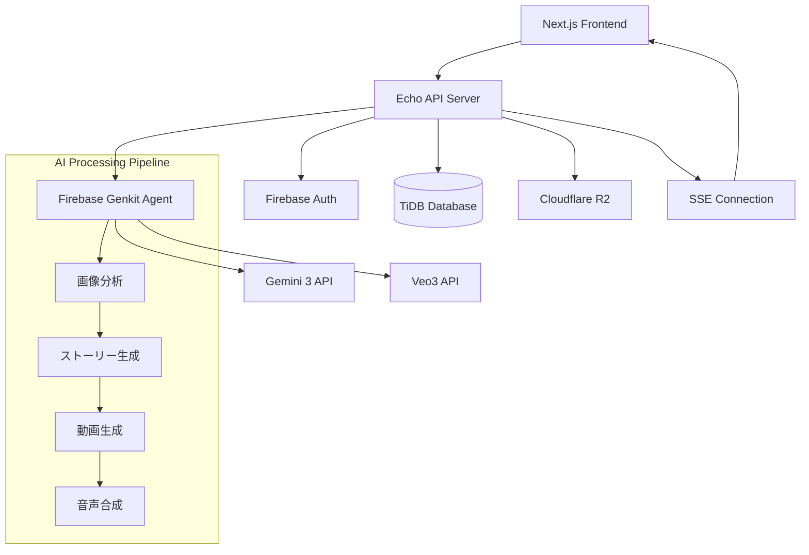

# AI Vlog生成機能 - 技術設計書

## 概要

Firebase Genkit for GoとVertex AI (Gemini 3)、Veo3を活用したAI旅行Vlog自動生成機能の詳細技術設計書です。非同期処理、SSEリアルタイム通信、未認証ユーザー対応を含む包括的な実装設計を定義します。

## アーキテクチャ設計

### システム全体アーキテクチャ



### レイヤーアーキテクチャ

- **Presentation Layer**: HTTP Handlers, SSE Handler
- **Application Layer**: Vlog Service, Job Service, Auth Service
- **Domain Layer**: Vlog Entity, Job Entity, User Entity
- **Infrastructure Layer**: Genkit Agent, Database Repository, Storage Repository, SSE Manager

## データベース設計

### 新規テーブル

#### vlog_jobs テーブル

```sql
CREATE TABLE IF NOT EXISTS vlog_jobs (
    id VARCHAR(255) PRIMARY KEY,
    version INT NOT NULL DEFAULT 0,
    user_id VARCHAR(255) NULL,
    session_token VARCHAR(255) NULL,
    job_type VARCHAR(50) NOT NULL DEFAULT 'vlog_generation',
    status VARCHAR(50) NOT NULL DEFAULT 'queued',
    progress_percentage INT DEFAULT 0,
    current_step VARCHAR(100) NULL,
    estimated_completion_time TIMESTAMP NULL,
    error_message TEXT NULL,
    input_data JSON NULL,
    result_data JSON NULL,
    created_at TIMESTAMP NOT NULL DEFAULT CURRENT_TIMESTAMP,
    updated_at TIMESTAMP NOT NULL DEFAULT CURRENT_TIMESTAMP ON UPDATE CURRENT_TIMESTAMP,
    deleted_at TIMESTAMP NULL,

    INDEX idx_user_id (user_id),
    INDEX idx_session_token (session_token),
    INDEX idx_status (status)
);
```

#### anonymous_sessions テーブル

```sql
CREATE TABLE IF NOT EXISTS anonymous_sessions (
    id VARCHAR(255) PRIMARY KEY,
    version INT NOT NULL DEFAULT 0,
    session_token VARCHAR(255) UNIQUE NOT NULL,
    usage_count INT DEFAULT 0,
    max_usage_count INT DEFAULT 1,
    expires_at TIMESTAMP NOT NULL,
    created_at TIMESTAMP NOT NULL DEFAULT CURRENT_TIMESTAMP,
    updated_at TIMESTAMP NOT NULL DEFAULT CURRENT_TIMESTAMP ON UPDATE CURRENT_TIMESTAMP,
    deleted_at TIMESTAMP NULL,

    INDEX idx_session_token (session_token),
    INDEX idx_expires_at (expires_at)
);
```

### 既存テーブル拡張

#### vlogs テーブル拡張

```sql
ALTER TABLE vlogs
ADD COLUMN title VARCHAR(255) NULL AFTER video_url,
ADD COLUMN description TEXT NULL AFTER title,
ADD COLUMN status VARCHAR(50) NOT NULL DEFAULT 'processing' AFTER description,
ADD COLUMN metadata JSON NULL AFTER status,
ADD INDEX idx_status (status);
```

## API設計

### エンドポイント仕様

#### POST /api/agent/create-vlog

- **機能**: Vlog生成開始
- **認証**: Firebase Auth または 未認証セッション
- **入力**: multipart/form-data (画像・動画ファイル)
- **出力**: ジョブID、VlogID、SSEエンドポイント

#### GET /api/agent/vlog/{id}/status

- **機能**: ジョブステータス確認
- **認証**: 必須
- **出力**: 進行状況、推定完了時間、結果URL

#### GET /api/sse/connect/{jobId}

- **機能**: SSE接続
- **認証**: 必須
- **出力**: リアルタイム進行状況イベント

## Firebase Genkit Agent設計

### AIエージェント構成

```go
type GenkitAgent interface {
    GenerateVlog(ctx context.Context, req VlogGenerationRequest) (*VlogGenerationResponse, error)
    AnalyzeImages(ctx context.Context, images []ImageData) (*ImageAnalysisResult, error)
    GenerateStory(ctx context.Context, analysis ImageAnalysisResult) (*StoryResult, error)
    GenerateVideo(ctx context.Context, story StoryResult, images []ImageData) (*VideoResult, error)
}
```

### 処理フロー

1. **画像分析フェーズ**: Gemini 3による画像内容・感情・ストーリー分析
2. **ストーリー生成フェーズ**: 分析結果からVlogストーリー構成
3. **動画生成フェーズ**: Veo3による動画またはスライドショー生成
4. **音声合成フェーズ**: ずんだもん音声生成
5. **最終合成フェーズ**: FFmpegによる動画・音声・字幕合成

## SSE（Server-Sent Events）設計

### イベント形式

```go
type SSEEvent struct {
    Type string      `json:"type"`
    Data interface{} `json:"data"`
}

// イベントタイプ
const (
    EventTypeStatus     = "status"
    EventTypeStep       = "step"
    EventTypeAIAnalysis = "ai_analysis"
    EventTypeProgress   = "progress"
    EventTypeCompleted  = "completed"
    EventTypeError      = "error"
)
```

### 接続管理

```go
type SSEManager struct {
    connections map[string]*Connection
    mutex       sync.RWMutex
}

type Connection struct {
    JobID    string
    UserID   string
    Channel  chan SSEEvent
    Context  context.Context
    Cancel   context.CancelFunc
}
```

## エラーハンドリング設計

### エラー分類

- **4xx ユーザーエラー**: 無効リクエスト、認証エラー、権限不足
- **5xx システムエラー**: 内部エラー、外部API障害、タイムアウト

### リトライ戦略

```go
type RetryConfig struct {
    MaxRetries    int
    InitialDelay  time.Duration
    MaxDelay      time.Duration
    BackoffFactor float64
}
```

### サーキットブレーカー

外部API（Gemini 3、Veo3）呼び出し保護のためのサーキットブレーカー実装。

## パフォーマンス設計

### 処理時間目標

- **5枚以下の画像**: 5分以内
- **10枚以下の画像**: 10分以内

### 同時処理制限

- キューイングシステムによる負荷制御
- ワーカープールによる並行処理管理

### タイムアウト設定

- 画像枚数別タイムアウト設定
- コンテキストベースキャンセル

## セキュリティ設計

### 認証・認可

- Firebase Auth トークン検証
- 未認証ユーザーセッション管理
- リソースアクセス権限チェック

### データ保護

- 機密情報の適切な暗号化
- ログでの個人情報マスキング
- セキュアなエラーメッセージ

## 監視・ログ設計

### 構造化ログ

```go
type LogEntry struct {
    Level     string                 `json:"level"`
    Timestamp time.Time              `json:"timestamp"`
    Message   string                 `json:"message"`
    TraceID   string                 `json:"trace_id"`
    UserID    string                 `json:"user_id,omitempty"`
    JobID     string                 `json:"job_id,omitempty"`
    Fields    map[string]interface{} `json:"fields,omitempty"`
}
```

### メトリクス収集

- 処理時間、成功率、エラー率
- 外部API呼び出し統計
- システムリソース使用量

## テスト戦略

### プロパティベーステスト

36の正確性プロパティを定義し、各プロパティで最低100回の反復テストを実行。

### ユニットテスト

- 各コンポーネントの単体テスト
- モックを使用した外部依存関係の分離
- エッジケースとエラー条件のテスト

### 統合テスト

- エンドツーエンドのVlog生成フロー
- 外部API統合テスト
- データベース整合性テスト

## デプロイ・運用設計

### 環境設定

- Firebase Genkit for Go設定
- Vertex AI認証情報
- Cloudflare R2接続設定
- データベース接続設定

### スケーリング

- Cloud Run自動スケーリング
- データベース接続プール管理
- ストレージ容量監視

---

**作成日**: 2026-01-22
**バージョン**: 1.0
**関連仕様**: .kiro/specs/ai-vlog-generation/
