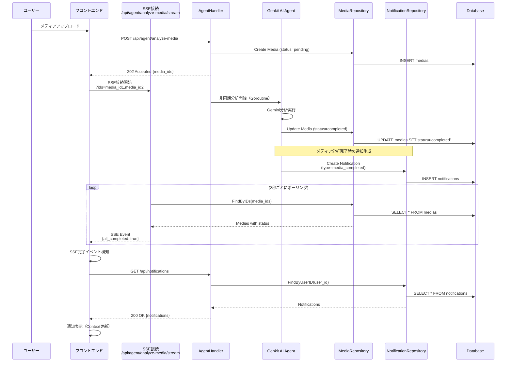
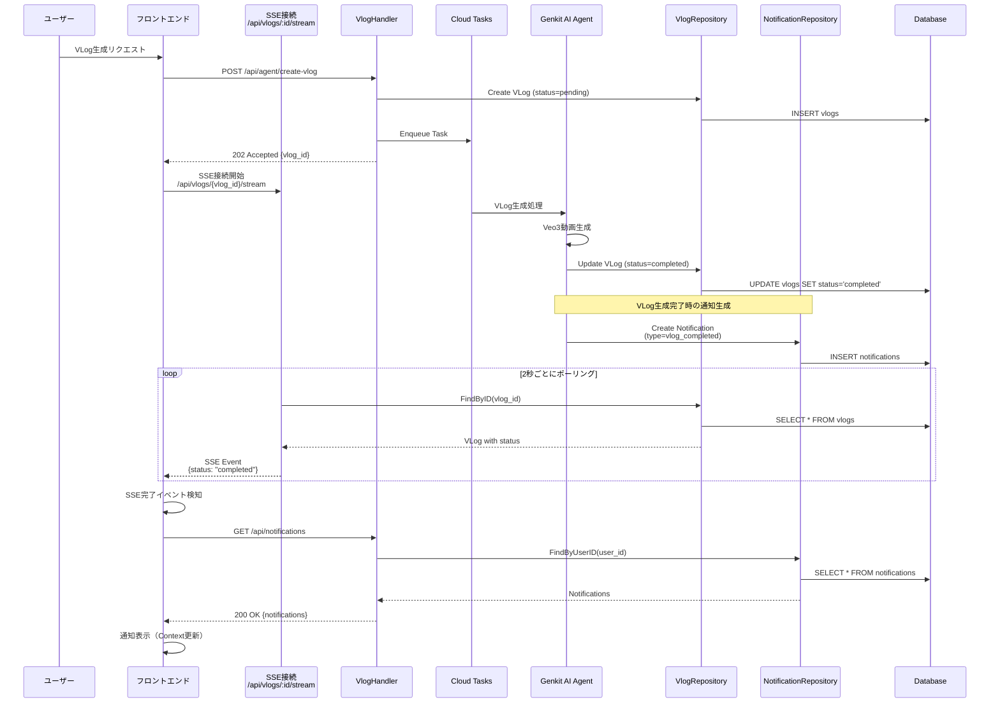
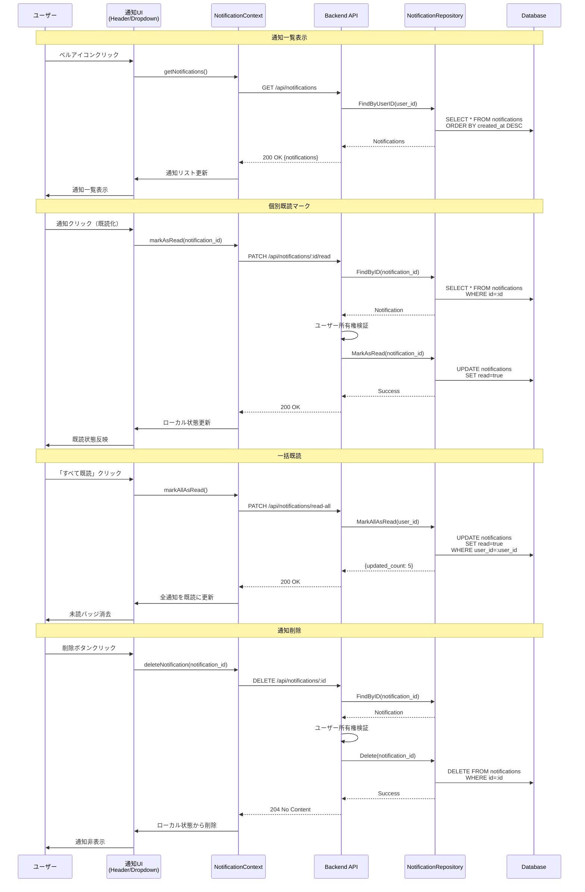

# 通知機能の永続化設計

## 概要

### 背景

現在の通知機能はフロントエンド（React Context）でメモリ管理されており、ブラウザリロードで消失します。メディア分析やVLog生成の完了・失敗通知をユーザーに確実に届けるため、バックエンドでの永続化が必要です。

### 目的

1. **通知の永続化**: データベースに保存し、ブラウザリロード後も通知を保持
2. **既存SSEとの統合**: メディア分析・VLog生成の既存SSEエンドポイントを維持しつつ、完了時にDB通知を作成
3. **REST APIによる通知管理**: 通知の取得・既読管理・削除をAPIで提供
4. **ユーザー認証**: Firebase Authによる権限管理で、ユーザーは自分の通知のみ操作可能

### スコープ

**実装範囲**:
- メディア分析完了/失敗時の通知自動生成
- VLog生成完了/失敗時の通知自動生成
- 通知のCRUD REST API（取得・既読・一括既読・削除）
- フロントエンドのSSE完了イベント受信時のAPI連携

**実装対象外**:
- 汎用通知SSEエンドポイント（既存SSE優先）
- 通知の自動削除機能（保持期間管理）
- 優先度フィールド（typeのみで管理）

---

## データモデル

### notificationsテーブル

| カラム名 | 型 | 制約 | 説明 |
|---------|-----|------|------|
| id | VARCHAR(26) | PRIMARY KEY | ULID形式のID |
| user_id | VARCHAR(255) | NOT NULL, INDEX | Firebase AuthのユーザーID |
| type | VARCHAR(50) | NOT NULL | 通知タイプ（media_completed, media_failed, vlog_completed, vlog_failed） |
| title | VARCHAR(255) | NOT NULL | 通知タイトル |
| message | TEXT | NOT NULL | 通知メッセージ |
| media_id | VARCHAR(26) | NULL, INDEX | 関連メディアID（任意） |
| vlog_id | VARCHAR(26) | NULL, INDEX | 関連VLogID（任意） |
| `read` | BOOLEAN | NOT NULL, DEFAULT FALSE | 既読フラグ |
| created_at | TIMESTAMP | NOT NULL, DEFAULT CURRENT_TIMESTAMP | 作成日時 |
| updated_at | TIMESTAMP | NOT NULL, DEFAULT CURRENT_TIMESTAMP ON UPDATE CURRENT_TIMESTAMP | 更新日時 |

**インデックス**:
```sql
CREATE INDEX idx_notifications_user_created ON notifications(user_id, created_at DESC);
CREATE INDEX idx_notifications_media_id ON notifications(media_id);
CREATE INDEX idx_notifications_vlog_id ON notifications(vlog_id);
```

**外部キー**:
```sql
FOREIGN KEY (media_id) REFERENCES medias(id) ON DELETE SET NULL;
FOREIGN KEY (vlog_id) REFERENCES vlogs(id) ON DELETE SET NULL;
```

### 通知タイプ定数

| 定数名 | 値 | 説明 |
|--------|-----|------|
| NotificationTypeMediaCompleted | "media_completed" | メディア分析完了 |
| NotificationTypeMediaFailed | "media_failed" | メディア分析失敗 |
| NotificationTypeVlogCompleted | "vlog_completed" | VLog生成完了 |
| NotificationTypeVlogFailed | "vlog_failed" | VLog生成失敗 |

### サンプルデータ

```json
{
  "id": "01HQZX8F7VWKQN2Y3C4R5T6U7A",
  "user_id": "firebase_user_abc123",
  "type": "media_completed",
  "title": "メディア分析完了",
  "message": "3件の画像・動画の分析が完了しました",
  "media_id": "01HQZX8F7VWKQN2Y3C4R5T6U7B",
  "vlog_id": null,
  "read": false,
  "created_at": "2026-02-01T10:30:00Z",
  "updated_at": "2026-02-01T10:30:00Z"
}
```

---

## API仕様

### 1. GET /api/notifications

**説明**: ログインユーザーの通知一覧を取得（created_at降順）

**認証**: 必須（Firebase Auth JWT）

**リクエスト**:
```
GET /api/notifications
Authorization: Bearer <firebase_jwt_token>
```

**レスポンス** (200 OK):
```json
{
  "notifications": [
    {
      "id": "01HQZX8F7VWKQN2Y3C4R5T6U7A",
      "user_id": "firebase_user_abc123",
      "type": "media_completed",
      "title": "メディア分析完了",
      "message": "3件の画像・動画の分析が完了しました",
      "media_id": "01HQZX8F7VWKQN2Y3C4R5T6U7B",
      "vlog_id": null,
      "read": false,
      "created_at": "2026-02-01T10:30:00Z",
      "updated_at": "2026-02-01T10:30:00Z"
    }
  ],
  "unread_count": 5
}
```

**エラーレスポンス**:
- 401 Unauthorized: 認証失敗
- 500 Internal Server Error: サーバーエラー

---

### 2. PATCH /api/notifications/:id/read

**説明**: 指定した通知を既読にする

**認証**: 必須（Firebase Auth JWT）

**リクエスト**:
```
PATCH /api/notifications/01HQZX8F7VWKQN2Y3C4R5T6U7A/read
Authorization: Bearer <firebase_jwt_token>
```

**レスポンス** (200 OK):
```json
{
  "id": "01HQZX8F7VWKQN2Y3C4R5T6U7A",
  "read": true,
  "updated_at": "2026-02-01T11:00:00Z"
}
```

**エラーレスポンス**:
- 401 Unauthorized: 認証失敗
- 403 Forbidden: 他のユーザーの通知にアクセス
- 404 Not Found: 通知が存在しない
- 500 Internal Server Error: サーバーエラー

---

### 3. PATCH /api/notifications/read-all

**説明**: ログインユーザーの全通知を既読にする

**認証**: 必須（Firebase Auth JWT）

**リクエスト**:
```
PATCH /api/notifications/read-all
Authorization: Bearer <firebase_jwt_token>
```

**レスポンス** (200 OK):
```json
{
  "updated_count": 5,
  "message": "All notifications marked as read"
}
```

**エラーレスポンス**:
- 401 Unauthorized: 認証失敗
- 500 Internal Server Error: サーバーエラー

---

### 4. DELETE /api/notifications/:id

**説明**: 指定した通知を削除する

**認証**: 必須（Firebase Auth JWT）

**リクエスト**:
```
DELETE /api/notifications/01HQZX8F7VWKQN2Y3C4R5T6U7A
Authorization: Bearer <firebase_jwt_token>
```

**レスポンス** (204 No Content):
```
(空のレスポンス)
```

**エラーレスポンス**:
- 401 Unauthorized: 認証失敗
- 403 Forbidden: 他のユーザーの通知にアクセス
- 404 Not Found: 通知が存在しない
- 500 Internal Server Error: サーバーエラー

---

## 処理フロー

### 1. メディア分析完了時の通知生成フロー



### 2. VLog生成完了時の通知生成フロー



### 3. フロントエンド通知操作フロー



---

## 実装詳細

### バックエンド実装

#### 1. Domain Layer (`backend/internal/domain/notification.go`)

```go
package domain

import (
    "time"
)

// 通知タイプ定数
const (
    NotificationTypeMediaCompleted = "media_completed"
    NotificationTypeMediaFailed    = "media_failed"
    NotificationTypeVlogCompleted  = "vlog_completed"
    NotificationTypeVlogFailed     = "vlog_failed"
)

// Notification - 通知ドメインモデル
type Notification struct {
    ID        string     `json:"id" gorm:"primaryKey;type:varchar(26)"`
    UserID    string     `json:"user_id" gorm:"type:varchar(255);not null;index"`
    Type      string     `json:"type" gorm:"type:varchar(50);not null"`
    Title     string     `json:"title" gorm:"type:varchar(255);not null"`
    Message   string     `json:"message" gorm:"type:text;not null"`
    MediaID   *string    `json:"media_id,omitempty" gorm:"type:varchar(26);index"`
    VlogID    *string    `json:"vlog_id,omitempty" gorm:"type:varchar(26);index"`
    Read      bool       `json:"read" gorm:"not null;default:false"`
    CreatedAt time.Time  `json:"created_at" gorm:"not null"`
    UpdatedAt time.Time  `json:"updated_at" gorm:"not null"`
}

// TableName - テーブル名を指定
func (Notification) TableName() string {
    return "notifications"
}

// Validate - 通知のバリデーション
func (n *Notification) Validate() error {
    if n.UserID == "" {
        return ErrInvalidNotification("user_id is required")
    }
    if n.Type == "" {
        return ErrInvalidNotification("type is required")
    }
    if n.Title == "" {
        return ErrInvalidNotification("title is required")
    }
    if n.Message == "" {
        return ErrInvalidNotification("message is required")
    }
    
    // タイプの検証
    validTypes := []string{
        NotificationTypeMediaCompleted,
        NotificationTypeMediaFailed,
        NotificationTypeVlogCompleted,
        NotificationTypeVlogFailed,
    }
    isValidType := false
    for _, validType := range validTypes {
        if n.Type == validType {
            isValidType = true
            break
        }
    }
    if !isValidType {
        return ErrInvalidNotification("invalid notification type")
    }
    
    return nil
}

// INotificationRepository - 通知リポジトリインターフェース
type INotificationRepository interface {
    Create(notification *Notification) error
    FindByID(id string) (*Notification, error)
    FindByUserID(userID string) ([]*Notification, error)
    MarkAsRead(id string) error
    MarkAllAsRead(userID string) (int64, error)
    Delete(id string) error
    CountUnread(userID string) (int64, error)
}
```

#### 2. Repository Layer (`backend/internal/infra/notification_repository.go`)

```go
package infra

import (
    "context"
    "time"
    
    "gorm.io/gorm"
    "zenn-hackthon-2026/backend/internal/domain"
    "zenn-hackthon-2026/backend/pkg/ulid"
)

type notificationRepository struct {
    db *gorm.DB
}

// NewNotificationRepository - NotificationRepositoryの生成
func NewNotificationRepository(db *gorm.DB) domain.INotificationRepository {
    return &notificationRepository{db: db}
}

// Create - 通知を作成
func (r *notificationRepository) Create(notification *domain.Notification) error {
    if notification.ID == "" {
        notification.ID = ulid.Generate()
    }
    notification.CreatedAt = time.Now()
    notification.UpdatedAt = time.Now()
    
    if err := notification.Validate(); err != nil {
        return err
    }
    
    return r.db.Create(notification).Error
}

// FindByID - IDで通知を取得
func (r *notificationRepository) FindByID(id string) (*domain.Notification, error) {
    var notification domain.Notification
    if err := r.db.Where("id = ?", id).First(&notification).Error; err != nil {
        return nil, err
    }
    return &notification, nil
}

// FindByUserID - ユーザーIDで通知を取得（created_at降順）
func (r *notificationRepository) FindByUserID(userID string) ([]*domain.Notification, error) {
    var notifications []*domain.Notification
    if err := r.db.Where("user_id = ?", userID).
        Order("created_at DESC").
        Find(&notifications).Error; err != nil {
        return nil, err
    }
    return notifications, nil
}

// MarkAsRead - 通知を既読にする
func (r *notificationRepository) MarkAsRead(id string) error {
    return r.db.Model(&domain.Notification{}).
        Where("id = ?", id).
        Updates(map[string]interface{}{
            "read":       true,
            "updated_at": time.Now(),
        }).Error
}

// MarkAllAsRead - ユーザーの全通知を既読にする
func (r *notificationRepository) MarkAllAsRead(userID string) (int64, error) {
    result := r.db.Model(&domain.Notification{}).
        Where("user_id = ? AND read = ?", userID, false).
        Updates(map[string]interface{}{
            "read":       true,
            "updated_at": time.Now(),
        })
    
    if result.Error != nil {
        return 0, result.Error
    }
    
    return result.RowsAffected, nil
}

// Delete - 通知を削除
func (r *notificationRepository) Delete(id string) error {
    return r.db.Delete(&domain.Notification{}, "id = ?", id).Error
}

// CountUnread - 未読通知数を取得
func (r *notificationRepository) CountUnread(userID string) (int64, error) {
    var count int64
    if err := r.db.Model(&domain.Notification{}).
        Where("user_id = ? AND read = ?", userID, false).
        Count(&count).Error; err != nil {
        return 0, err
    }
    return count, nil
}
```

#### 3. Handler Layer (`backend/internal/handler/notification.go`)

```go
package handler

import (
    "net/http"
    
    "github.com/labstack/echo/v4"
    "zenn-hackthon-2026/backend/internal/domain"
    "zenn-hackthon-2026/backend/pkg/context"
)

type NotificationHandler struct {
    notificationRepo domain.INotificationRepository
}

func NewNotificationHandler(notificationRepo domain.INotificationRepository) *NotificationHandler {
    return &NotificationHandler{
        notificationRepo: notificationRepo,
    }
}

// GetNotifications - 通知一覧取得
func (h *NotificationHandler) GetNotifications(c echo.Context) error {
    userID := context.GetUserID(c)
    
    notifications, err := h.notificationRepo.FindByUserID(userID)
    if err != nil {
        return echo.NewHTTPError(http.StatusInternalServerError, "Failed to fetch notifications")
    }
    
    unreadCount, err := h.notificationRepo.CountUnread(userID)
    if err != nil {
        return echo.NewHTTPError(http.StatusInternalServerError, "Failed to count unread notifications")
    }
    
    return c.JSON(http.StatusOK, map[string]interface{}{
        "notifications": notifications,
        "unread_count":  unreadCount,
    })
}

// MarkAsRead - 通知を既読にする
func (h *NotificationHandler) MarkAsRead(c echo.Context) error {
    userID := context.GetUserID(c)
    notificationID := c.Param("id")
    
    // 通知の所有権を確認
    notification, err := h.notificationRepo.FindByID(notificationID)
    if err != nil {
        return echo.NewHTTPError(http.StatusNotFound, "Notification not found")
    }
    
    if notification.UserID != userID {
        return echo.NewHTTPError(http.StatusForbidden, "Access denied")
    }
    
    if err := h.notificationRepo.MarkAsRead(notificationID); err != nil {
        return echo.NewHTTPError(http.StatusInternalServerError, "Failed to mark notification as read")
    }
    
    // 更新後の通知を返す
    updatedNotification, _ := h.notificationRepo.FindByID(notificationID)
    
    return c.JSON(http.StatusOK, updatedNotification)
}

// MarkAllAsRead - 全通知を既読にする
func (h *NotificationHandler) MarkAllAsRead(c echo.Context) error {
    userID := context.GetUserID(c)
    
    updatedCount, err := h.notificationRepo.MarkAllAsRead(userID)
    if err != nil {
        return echo.NewHTTPError(http.StatusInternalServerError, "Failed to mark all notifications as read")
    }
    
    return c.JSON(http.StatusOK, map[string]interface{}{
        "updated_count": updatedCount,
        "message":       "All notifications marked as read",
    })
}

// DeleteNotification - 通知を削除
func (h *NotificationHandler) DeleteNotification(c echo.Context) error {
    userID := context.GetUserID(c)
    notificationID := c.Param("id")
    
    // 通知の所有権を確認
    notification, err := h.notificationRepo.FindByID(notificationID)
    if err != nil {
        return echo.NewHTTPError(http.StatusNotFound, "Notification not found")
    }
    
    if notification.UserID != userID {
        return echo.NewHTTPError(http.StatusForbidden, "Access denied")
    }
    
    if err := h.notificationRepo.Delete(notificationID); err != nil {
        return echo.NewHTTPError(http.StatusInternalServerError, "Failed to delete notification")
    }
    
    return c.NoContent(http.StatusNoContent)
}
```

#### 4. ルーティング設定 (`backend/internal/server/server.go`)

```go
// 通知API（認証必須）
notificationHandler := handler.NewNotificationHandler(notificationRepo)
api.GET("/notifications", notificationHandler.GetNotifications)
api.PATCH("/notifications/:id/read", notificationHandler.MarkAsRead)
api.PATCH("/notifications/read-all", notificationHandler.MarkAllAsRead)
api.DELETE("/notifications/:id", notificationHandler.DeleteNotification)
```

### フロントエンド実装

#### 1. API Client (`frontend/api/notificationApi.ts`)

```typescript
import { apiClient } from './client';

export interface Notification {
  id: string;
  user_id: string;
  type: 'media_completed' | 'media_failed' | 'vlog_completed' | 'vlog_failed';
  title: string;
  message: string;
  media_id?: string;
  vlog_id?: string;
  read: boolean;
  created_at: string;
  updated_at: string;
}

export interface NotificationListResponse {
  notifications: Notification[];
  unread_count: number;
}

export const notificationApi = {
  getNotifications: async (): Promise<NotificationListResponse> => {
    const response = await apiClient.get('/notifications');
    return response.data;
  },

  markAsRead: async (id: string): Promise<Notification> => {
    const response = await apiClient.patch(`/notifications/${id}/read`);
    return response.data;
  },

  markAllAsRead: async (): Promise<{ updated_count: number; message: string }> => {
    const response = await apiClient.patch('/notifications/read-all');
    return response.data;
  },

  deleteNotification: async (id: string): Promise<void> => {
    await apiClient.delete(`/notifications/${id}`);
  },
};
```

#### 2. NotificationContext更新 (`frontend/context/notificationContext.tsx`)

```typescript
// addNotification の他に、以下のメソッドを追加

const fetchNotifications = async () => {
  try {
    const data = await notificationApi.getNotifications();
    setNotifications(data.notifications);
  } catch (error) {
    console.error('Failed to fetch notifications:', error);
  }
};

const markAsRead = async (id: string) => {
  try {
    await notificationApi.markAsRead(id);
    setNotifications(prev =>
      prev.map(n => n.id === id ? { ...n, read: true } : n)
    );
  } catch (error) {
    console.error('Failed to mark notification as read:', error);
  }
};

const markAllAsRead = async () => {
  try {
    await notificationApi.markAllAsRead();
    setNotifications(prev => prev.map(n => ({ ...n, read: true })));
  } catch (error) {
    console.error('Failed to mark all notifications as read:', error);
  }
};

const deleteNotification = async (id: string) => {
  try {
    await notificationApi.deleteNotification(id);
    setNotifications(prev => prev.filter(n => n.id !== id));
  } catch (error) {
    console.error('Failed to delete notification:', error);
  }
};

// ログイン時に通知を読み込む
useEffect(() => {
  if (user) {
    fetchNotifications();
  }
}, [user]);
```

#### 3. SSE完了時の通知取得 (`frontend/hooks/useMediaSSE.ts`)

```typescript
// SSE完了イベント受信時
eventSource.current.addEventListener('message', (event) => {
  const data: MediaStatusResponse = JSON.parse(event.data);
  
  if (data.all_completed) {
    // 通知をAPIから取得
    notificationApi.getNotifications().then(response => {
      // NotificationContextに通知を追加（マージ処理）
      response.notifications.forEach(notification => {
        if (!notification.read) {
          addNotification(notification);
        }
      });
    });
  }
});
```

---

## 技術的考慮事項

### 1. エラーハンドリング

**バックエンド**:
- データベースエラー: 500 Internal Server Error
- 認証エラー: 401 Unauthorized
- 権限エラー: 403 Forbidden（他ユーザーの通知操作時）
- リソース未発見: 404 Not Found

**フロントエンド**:
- API呼び出し失敗時はコンソールログ出力
- ユーザーには既存のローカル状態を表示
- リトライロジックは実装しない（ユーザー再操作に委ねる）

### 2. パフォーマンス

**インデックス戦略**:
- `(user_id, created_at DESC)`: 通知一覧取得の高速化
- `media_id`, `vlog_id`: 関連リソースからの通知検索用

**クエリ最適化**:
- 一覧取得はページネーション不要（フロントで絞る）
- 未読数カウントは `COUNT(*) WHERE read=false` で高速化

**SSE接続管理**:
- 既存の2秒ポーリングを維持
- 通知取得は完了時のみ（定期ポーリング不要）

### 3. セキュリティ

**認証・認可**:
- Firebase Auth JWTによるユーザー認証
- ユーザーIDベースの通知フィルタリング
- 通知操作前の所有権検証（FindByID → UserID照合）

**SQLインジェクション対策**:
- GORMのプレースホルダーによるパラメータ化クエリ

### 4. 将来の拡張性

**通知タイプの追加**:
- 定数追加のみで対応可能（例: `comment_added`, `shared_with_you`）
- Validateメソッドで新タイプを検証

**優先度フィールド追加**:
- `priority` カラム追加（`high`, `medium`, `low`）
- ソート順に反映（`ORDER BY priority DESC, created_at DESC`）

**汎用通知SSE**:
- 将来的に `/api/notifications/stream` エンドポイント追加可能
- Pub/Subパターンで既存SSEと統合

**通知自動削除**:
- Cloud Schedulerで定期バッチ実行
- `created_at < NOW() - INTERVAL 30 DAY` で古い通知を削除

---

## まとめ

本設計により、以下を実現します:

1. **永続化**: notificationsテーブルでブラウザリロード後も通知を保持
2. **既存SSEとの共存**: メディア分析・VLog生成SSEを維持しつつ、完了時にDB通知を生成
3. **REST API**: 通知の取得・既読管理・削除をシンプルなAPIで提供
4. **権限管理**: Firebase Authによるユーザー認証と所有権検証
5. **拡張性**: 新しい通知タイプ・優先度・汎用SSEへの対応が容易

**次のステップ**: マイグレーション実行 → バックエンド実装 → フロントエンド統合 → テスト → デプロイ
